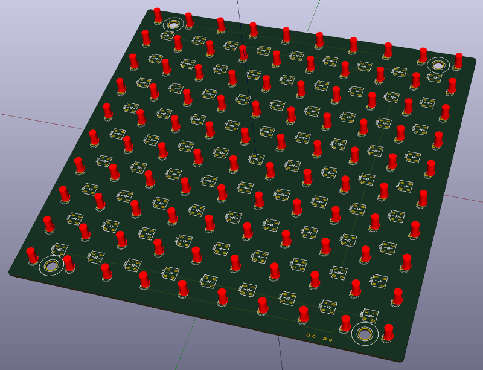

# dual_led_array 
PCB with dual arrays of IR and 628nm crimson leds. Arrays are 10x10 and 9x9 respectively. 

* [Bill-of-materials](BOM.txt)

# 3D View

# License: 
Creative Commons Attribution 4.0 International CC BY 4.0

